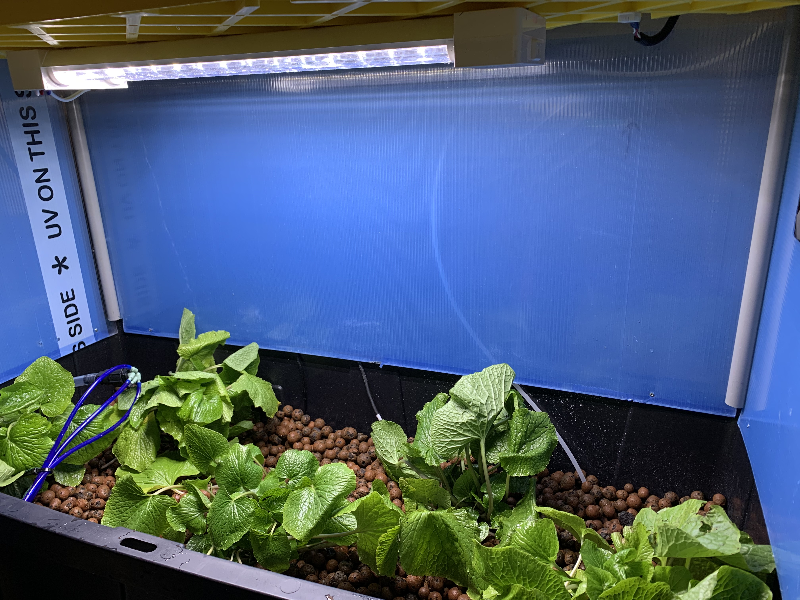

# DAVE

DAVE - or the *"Deterministic Agriculture Virtualization Environment"* - is a controlled-environment micro-greenhouse designed to grow and collect data on wasabi. Based upon the work of [MIT Media Lab’s Open Agriculture Initiative](https://www.media.mit.edu/groups/open-agriculture-openag/overview/).

By synchronizing existing botanical *Wasabia japonica* research across all environment variables (See below) and comparing yield and quality to commercial samples, analysis can be done on the relative efficacy of "food computers" for wasabi agriculture.

## Research Paper

Originally an AP Capstone project, "DAVE: Optimizing Wasabi Agriculture Through Automation and Successive Approximation" was published in September of 2019. View it [**here**](https://www.researchgate.net/publication/344294857_DAVE_Optimizing_Wasabi_Agriculture_Through_Automation_and_Successive_Approximation).

## Environment Variables
See the research paper for literature review.

- Air Humidity (80%)
- Air Temperature (12-15°C)
- Water Temperature (9-12°C)
- pH (5.5-6.0)
- Two-Part A+B hydroponic nutrients
- 6 hours daily light (red + blue LED)

